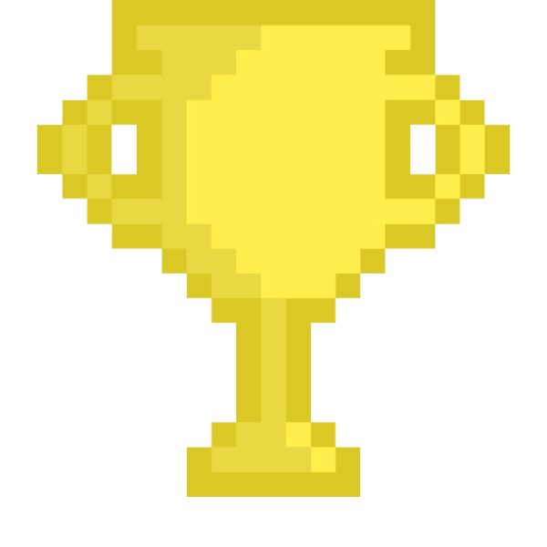

#  Game Box by Lili 

Olá, pessoal! Estou animada para apresentar o **Game Box by Lili**, quando estudei o Bootcamp Potência Tech iFood - Desenvolvimento de Jogos na [Dio.me](https://web.dio.me/home), fiz 4 jogos incríveis e divertidos. Tive a idéia de criar um box (site) para proporcionar uma experiência envolvente, divertida e desafiadora. Para treinar e evoluir o que aprendi em CSS, no box utilizei a stack SASS para me desafiar a tentar algo novo.
Criei um ambiente inspirado nos jogos antigos, com visual pixel com navegação horizontal.

##  Deploy:

<!--gif do site-->
## 

- [Game Box by Lili](https://game-box-by-lili.vercel.app/)

##  Jogos:

- ###  **Ralph - O Caçador de Vilões:**
  Um clássico de arcade onde você precisa capturar o vilão clicando nele. Uma experiência nostálgica para os amantes de jogos clássicos. 
  

- ###  **Desafio dos Pares:**
  Teste sua memória com este jogo de memória. Encontre os pares correspondentes e desafie sua mente.

  

- ###  **Piano Divertido:**
  Seja ousado com as teclas musicais neste jogo de piano interativo. Uma forma divertida de explorar a música.

  

- ###  **Yu-Gi-Oh Duelo:**
  Use a lógica e estratégia com cartas para derrotar o computador. Um desafio para os amantes de jogos de estratégia.

  

##  Stacks Utilizadas:

#### Jogos:
- HTML
- CSS
- JavaScript

#### Site:
- SASS
- React

##  Conclusão:

Acredito que ao fazer Bootcamps, tutoriais, imersões adicionar algo a mais é essencial para ir além e dar um toque pessoal para evoluir e nos destacar.
Este projeto é uma expressão do meu compromisso em aprender e aplicar novas habilidades.

##  Agradecimentos e Colaboração:

Agradeço à [Dio.me](https://web.dio.me/home) pela oportunidade de aprendizado e pela ênfase na educação gratuita e empregabilidade.

Agradecimentos especiais a [Karla Oshikawa](https://github.com/karlaoshikawa) pela colaboração, revisão e suporte no desenvolvimento do projeto.

##  Contato:

